# Active Directory Home Lab – Domain Services & Group Policy

## 📌 Project Overview
This project demonstrates the deployment and configuration of an on-premises Active Directory environment using VMware Workstation Pro. The lab simulates a small enterprise domain with centralized authentication, organizational units, bulk user creation, Group Policy enforcement, and security validation.

---

## 🧰 Technologies Used
- VMware Workstation Pro
- Windows Server 2022 (Domain Controller)
- Windows 10 (Domain Client)
- Active Directory Domain Services (AD DS)
- DNS
- Group Policy Management
- PowerShell
- Event Viewer

---

## 🏗️ Lab Architecture

- **DC01** – Windows Server 2022  
  - Active Directory Domain Services
  - DNS Server
  - Group Policy Management

- **CLIENT01** – Windows 10  
  - Domain-joined workstation

- **Domain Name:** `lab.local`
  
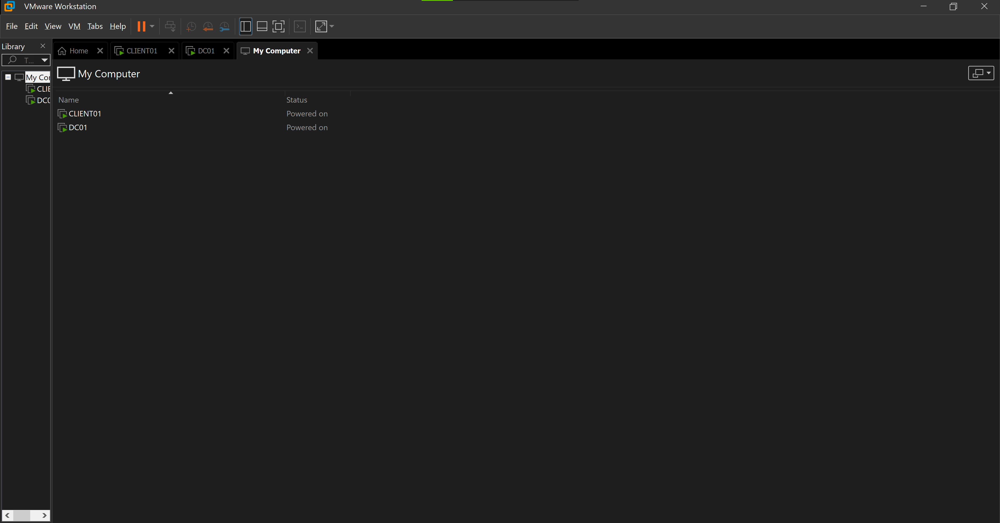
*Displays the two virtual machines (Domain Controller and Domain Client) configured in VMware Worksatation Pro.*

---

## 🔧 Configuration Steps

### 1️⃣ Domain Controller Setup
- Installed Windows Server 2022
- Promoted server to Domain Controller
- Created new forest: `lab.local`
- Verified AD DS and DNS functionality

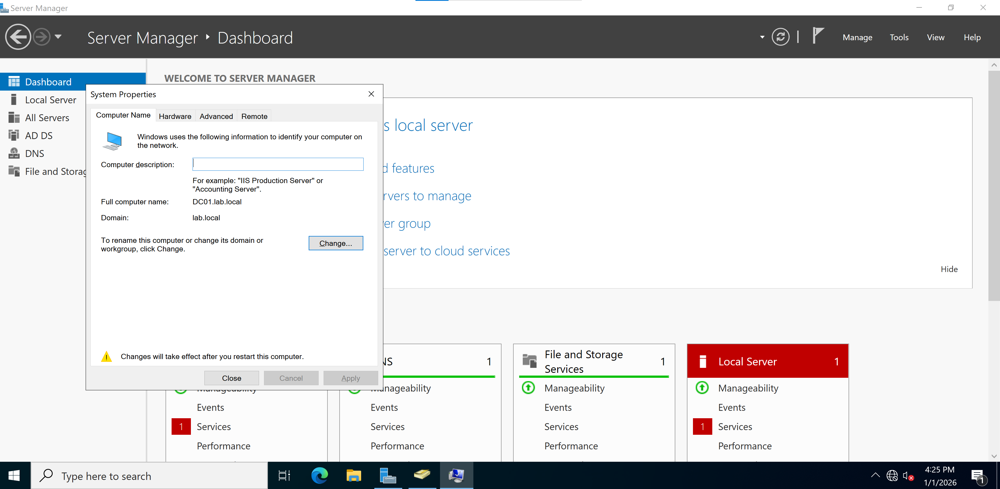
*Confirms Windows Server installation and system role as the Domain Controller.*

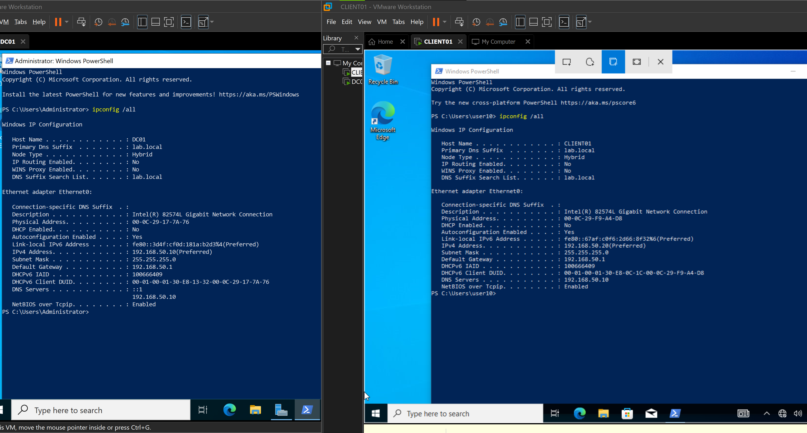
*Shows DNS service running on DC01 with the domain namesace configured.*

---

### 2️⃣ Organizational Units (OU)
- Created dedicated OUs for domain users
- Enabled deletion protection for OUs

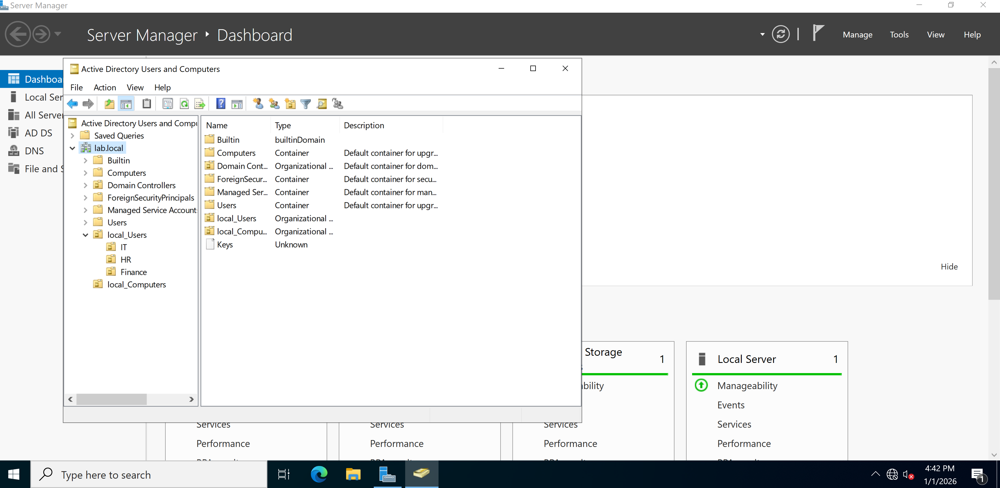
*Displays Organizational Units created for domain user management.*

---

### 3️⃣ Bulk User Creation
- Created 50 domain users using PowerShell
- Users placed in the designated OU
- Verified creation using ADUC and PowerShell

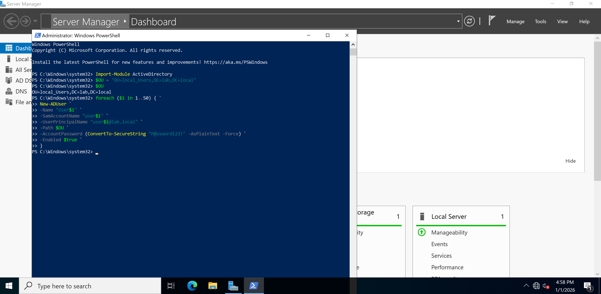
*PowerShell script used to create 50 domain users in Active Directory.*

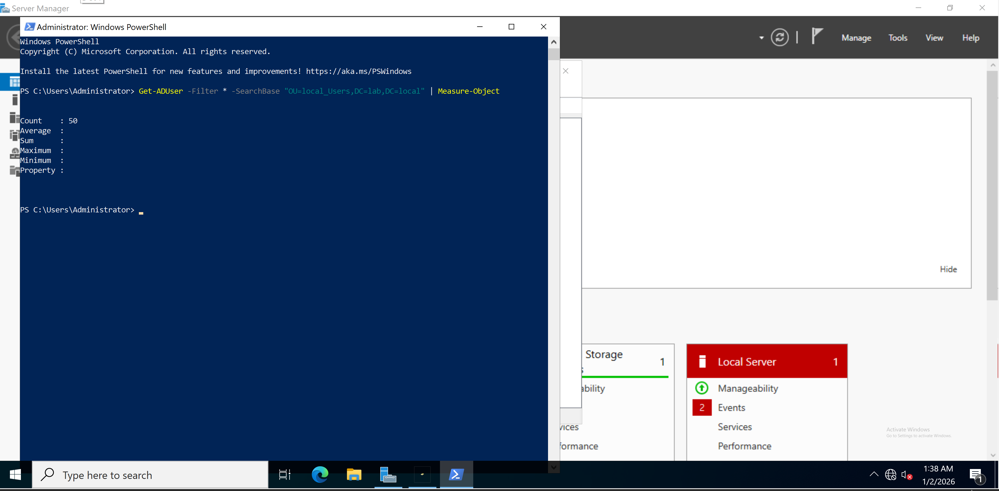
*PowerShell command verifying successful creation of all domain users.*

---

### 4️⃣ Domain Join (Client)
- Configured DNS to point to DC01
- Joined Windows 10 client to `lab.local`
- Verified secure domain trust

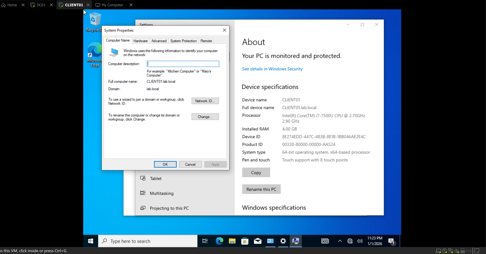 
*Confirms Windows client successfully joined the domain.*

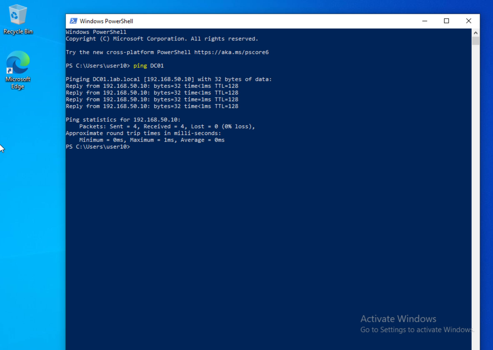
*Verifies the client system can successfully reach the domain controller using hostname-based DNS resolution.*

---

### 5️⃣ Group Policy Configuration
- Edited **Default Domain Policy** to enforce:
  - Password complexity
  - Minimum password length
  - Account lockout threshold and duration
- Policies applied domain-wide

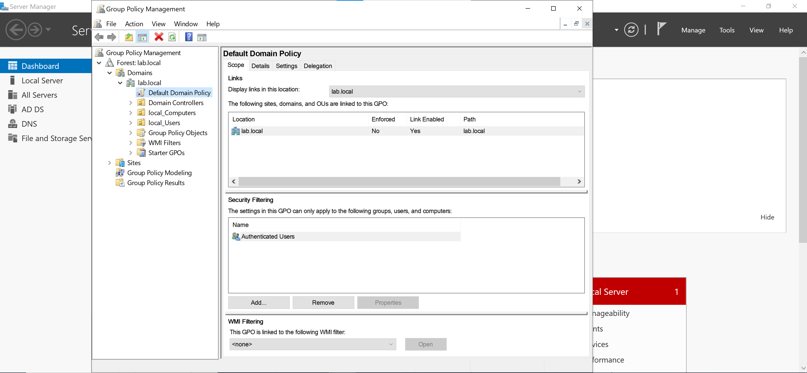
*Confirms the GPO is linked to the domain and applied to authenticated users.*

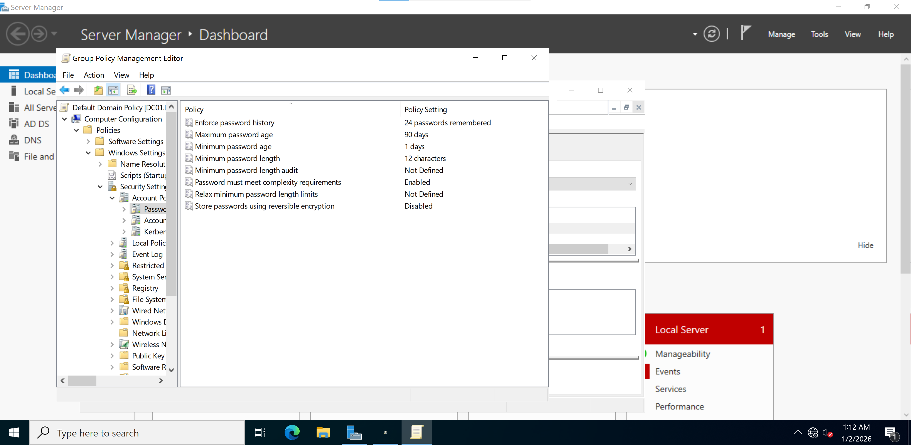
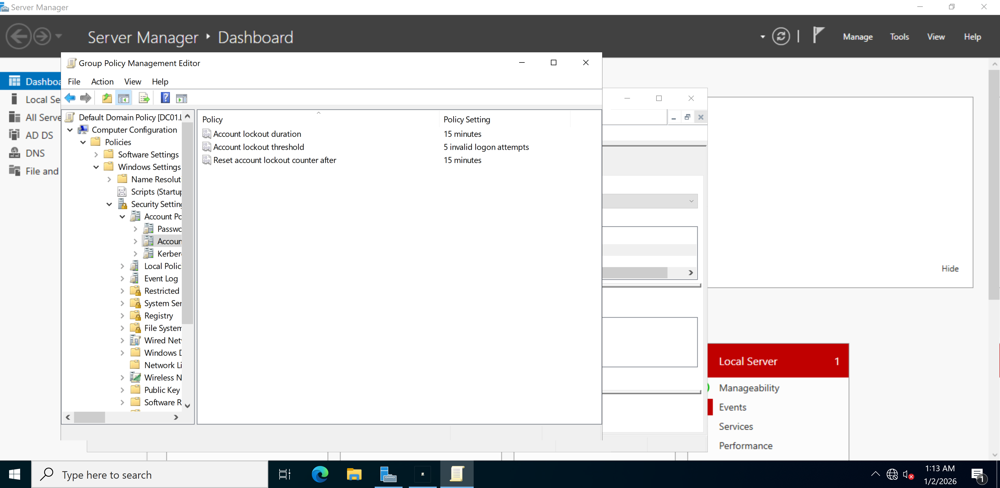
*Group Policy enforcing password complexity and account lockout settings.*

---

### 6️⃣ Authentication Validation
- Successfully authenticated domain users on CLIENT01
- Verified identity using `whoami`
- Triggered account lockout through failed logon attempts

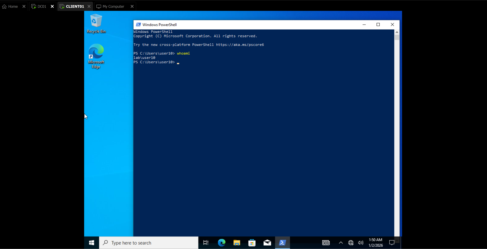
*Validates domain user authentication on the client system.*

*Confirms Group Policy applied successfully to the client machine.*

---

### 7️⃣ Security Event Logging
- Reviewed authentication logs on DC01
- Verified:
  - Event ID 4624 (successful logon)
  - Event ID 4625 (failed logon / lockout)

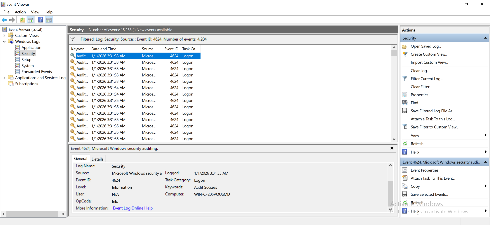
*Successful Logon Event (4624) – Confirms a domain user successfully authenticated to the domain.*

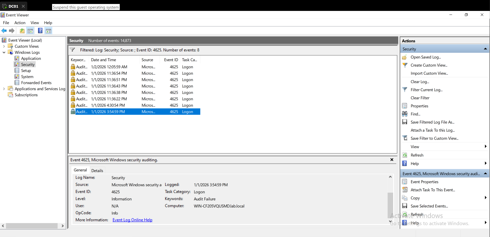
*Failed Logon Event (4625) – Shows unsuccessful authentication attempts and account lockout behavior.*

---

## 🔐 Security Controls Implemented
- Centralized domain authentication
- Password complexity enforcement
- Account lockout protection
- Audit logging of authentication events

---

## 🎯 Skills Demonstrated
- Active Directory administration
- Windows Server configuration
- Group Policy enforcement
- PowerShell automation
- Authentication troubleshooting
- Security event analysis

---

## 🚀 Future Improvements
- Fine-Grained Password Policies (FGPP)
- Additional Group Policy Objects (GPOs)
- SIEM integration (Splunk / Sentinel)
- Privileged Access Management (PAM)

---

## 🧠 Author
**Quincy Bryant**  
Entry-Level Cybersecurity / SOC Analyst Candidate
